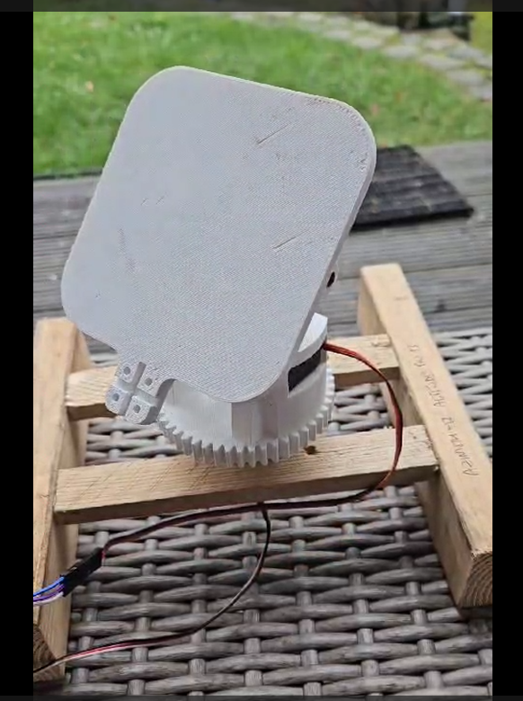

# SolarPanelSunTracker 
## by Colin Bacon
**Ever feel like your solar panel plays hide-and-seek with the sun?** Yep, me too! That's why I embarked on this project - a sun-tracking solar panel, a robotic sunflower if you will, to maximize its power-generating potential.

## Why a Sun Tracker? 
**It's a Powerhouse of Benefits:**

Energy Boost: Imagine your panel constantly facing the sun, soaking up every ray. That translates to increased energy production and efficiency, like a caffeinated athlete on steroids!

A solar panel sun tracker, with its tilting turntable and azimuth and altitude control, offers several benefits compared to a static solar panel position as follows:

1. Increased energy production: By constantly adjusting the position of the solar panel to face the sun directly, a sun tracker maximizes the amount of sunlight captured throughout the day. This leads to higher energy production and increased efficiency.
2. Improved efficiency: Sun trackers ensure that the solar panel is always oriented optimally, minimizing the angle of incidence between sunlight and the panel's surface. This allows for better absorption of solar radiation and improved conversion of sunlight into electricity.
3. Extended operational hours: Sun trackers enable the solar panel to track the sun's movement from sunrise to sunset. By following the sun's path, they capture sunlight for a longer duration compared to fixed panels, maximizing electricity generation throughout the day.
4. Enhanced seasonal performance: Sun trackers can accommodate seasonal changes in the sun's path. They can adjust the tilt and orientation of the solar panel to match the sun's position during different times of the year, optimizing energy production in all seasons.
5. Reduced solar panel shading: Sun trackers can actively monitor and mitigate shading issues caused by nearby objects such as trees, buildings, or other structures. By continuously adjusting the position of the solar panel, they can minimize shading and ensure maximum exposure to sunlight.
6. Cost-effectiveness: While sun trackers may require an initial investment, their increased energy production and efficiency, along with reduced shading, can result in higher overall energy savings. The additional electricity generated can offset the cost of the tracker over time.

These benefits make solar panel sun trackers an attractive option for maximizing solar energy generation and optimizing the performance of solar panel systems.

## Building the Brain:

This Proof of Concept (PoC) uses an ESP32 TTGO and 2 servo motors to transform the panel into a sun-chasing champion. The Arduino code serves as the brain of the operation, utilizing various libraries for internet connectivity, sun position tracking, display control, and servo movement. It's a symphony of technology working in harmony to achieve optimal sun tracking!

**Overview of Arduino libraries used:**
1. WiFiUdp.h: This library enables internet connectivity and connects to de.pool.ntp.org for network time synchronization.
2. NTPClient.h - A library to determine the current date and time. This connects to the Network Time Protocol in Germany, de.pool.ntp.org. Additional information can be found at --> https://www.ntppool.org/en/#news  The date and time are required as inputs to the sunPosition.h library, to determine the sun's position. 
3. SunPosition.h - A library developed by AlexGyver (https://github.com/GyverLibs/SunPosition) to track the sun's current position. My sketch is hardcoded with my current address near Aachen in Germany, so you'll need to update this line with your own location. The following website was used to validate the results of the sun position angles -> http://shadowcalculator.eu/#/lat/50.753824866570575/lng/6.020683529072293

4. TFT_eSPI.h - A library to control the display of the ESP32-TTGO display. It's recommended to download the library from GitHub as the version provided in the Arduino IDE may not work correctly --> https://www.lilygo.cc/en-pl/products/lilygo%C2%AE-ttgo-t-display-1-14-inch-lcd-esp32-control-board m  The TFT display is primarily used to show the current azimuth and altitude angles, where altitude represents the sun's angle to the horizon, and azimuth is the angle from the z-axis to the horizon.
5. ESP32Servo.h - A library to rotate the servo. It's a convenient library as it only requires defining the PWM pins, and angle values can be directly input without the need for mapping.

Once the sun sets in the evening (altitude of 0 degrees), the servos go to sleep until the next morning. A message is displayed at the bottom of the TFT display with sunset time as follows: 

## 3D printed model for the PoC:
Here is a 3D Printed model that I used for the PoC --> 

]  ((https://www.youtube.com/shorts/ansnRClUkbA)

## Total Sun Energy Calculations
This PoC setup could prove valuable for measuring the power increase achievable in your location by tracking the sun compared to keeping the solar panel fixed in one direction. To estimate potential savings based on average solar radiation data in your area, you can enhance accuracy by referencing historical weather data for a more precise estimation.

## Scaling Up Your Solar Panel Sun Tracker:
This section explores upgrading your sun tracker from RC servos to servo motors with greater torque and IP66 weatherproofing. This allows you to handle larger solar panels and ensures your tracker functions reliably outdoors.

While RC servos are perfectly suitable for building a proof-of-concept (PoC) and working with small solar panels, such as those used to charge mobile phones, they may lack the strength to move larger panels, like 400-watt models or entire banks of panels. But checkout the IP65 35kg torque RC Motors as an option too! 

**Here's what you'll need for the upgrade:**

 - **High-torque servo motors:** Choose motors capable of handling the    weight and resistance of your specific solar panels.
 - **IP66 enclosure:**    Protect your electronics from the elements with a weatherproof    enclosure.     
 - **ESP32 microcontroller:**
   Leverage the ESP32's built-in Wi-Fi    and web server functionality
   for real-time data and control through a    user-friendly webpage.

**Upgrade Steps:**

 - **Replace RC servos:** Swap them with higher-torque servo motors suitable for your panel size.
 - **Connect the ESP32:** Use the ESP32 board instead of the Arduino.
 - **Webserver control:** Utilize the ESP32's built-in web server to create a user-friendly webpage for configuration, control, and real-time data display, similar to the FluidNC program.

### Additional Considerations:

 - **Servo drivers:** While not essential, servo drivers can simplify wiring and power management for multiple motors.
 - **CNC shields, FluidNC and GRBL:** These options are suited for CNC applications but might be more complex than necessary for a simple
   sun tracker. They however use the remote connection to the ESP32 webserver which my provide a neat solution for suntracking and monitoring too. 
 - **IP66 enclosure:** Choose an enclosure size that comfortably fits your components and allows for cable management. Remember: Scaling up
   requires adjustments based on your specific panel size and motor
   choice. Research and choose components compatible with each other and
   your project's requirements.

# Next Steps - Power Up Your Future: 
This project lays the foundation for exciting future possibilities! Here are some ideas to propel your tracker further:

**1. Embrace Self-Sufficiency:** Imagine powering your entire system with the sun's energy! Explore integrating your solar panel to directly power the ESP32 and servos, showcasing sustainable energy goals in action. Check out [https://randomnerdtutorials.com/](https://randomnerdtutorials.com/) for inspiration.

**2. Unleash the Power of Data:** Transform your tracker into a data powerhouse! Equip it to measure and log the generated solar energy. Analyze this data to calculate average power output and assess the feasibility of larger-scale projects, turning raw numbers into valuable insights.

**3. Supercharge Your Project:** Ready to tackle bigger energy challenges? Consider scaling up by using significantly larger solar panels and stepper motors. These robust components will unleash your tracker's full potential, transforming it into a powerful solar powerhouse.
Remember, this is just the beginning! By exploring these next steps, you can turn your project into a valuable tool for maximizing solar energy potential and paving the way for a more sustainable future.

### Hardware Setup:

- Using a larger solar panel or array, I'll attach two stepper motors to the panel's frame.
- Connect the stepper motors to the ESP32 using a driver board (e.g., A4988 or DRV8825).
- The stepper motor will also be connected to the power source.

### Software Development:

- Develop a Node.js, P5 or Processing sketch in JavaScript and connect the Arduino IDE with the ESP32 board support.
- Implement code to read data from light sensors (like LDRs or photodiodes) to detect the sun's position. This will give an indication of the actual sunshine during the day.
- Use libraries like AccelStepper to control the stepper motors.  
 
### Safety and Maintenance:
- I'll implement some fail-safes to prevent damage during extreme weather conditions.
 - https://www.switchdoc.com/2020/06/tutorial-solar-power-selection-guide-for-maker-projects/
 - https://www.az-delivery.de/en/blogs/azdelivery-blog-fur-arduino-und-raspberry-pi/solar-tracker-mit-schrittmotoren-und-oled-display

## Dive Deeper:

Curious about building your own sun tracker? Here are some resources that provide more information on solar panel sun trackers and how to build them:

- Sun Tracking for More Solar Power - Part 1 - The Hardware: https://www.switchdoc.com/2016/05/sun-tracking-solar-power-part-1/
- f2knpw/ESP32_Solar_Tracker: low cost solar panel solution (MPPT + sun tracker). Here is the code for the Solar Tracker - GitHub: https://github.com/f2knpw/ESP32_Solar_Tracker
- DIY Portable Solar Tracker - How To Build Simple Tracker - Progressive Automation: https://www.progressiveautomations.com/blogs/how-to/how-to-build-a-portable-solar-tracker
- Solar Radiation Data Sources, Applications and Network Design - OSTI.GOV: https://www.osti.gov/servlets/purl/6652754
- Arduino Solar Tracker (Single or Dual Axis): 6 Steps (with Pictures) - Instructables: https://www.instructables.com/Arduino-Solar-Tracker-Single-or-Dual-Axis/
- Solar Tracker (ESP32 & MicroPython): 4 Steps - Instructables: https://www.instructables.com/Two-axis-Solar-Tracker-Controlled-by-ESP32-and-Pro/
- Online solar tracker:  [https://www.suncalc.org/#/40.1789,-3.5156,3/2023.09.05/16:21/1/3](https://www.suncalc.org/#/50.718,6.2535,17/2023.09.05/16:25/1/3)

### Reference Projects: 
- https://circuitdigest.com/microcontroller-projects/iot-solar-panel-power-monitoring-system-using-esp32-and-thingspeak, 
- https://www.opengreenenergy.com/diy-solar-panel-monitoring-system/
- https://www.seeedstudio.com/blog/2023/06/05/solar-panel-monitoring-system-built-with-xiao-esp32c3/
- https://docs.timos-werkstatt.de/open-cnc-shield-2/mainboard
- https://www.youtube.com/watch?v=cuQo0xxF-PA
- https://www.youtube.com/watch?v=PMrjN8njqHs
- http://wiki.fluidnc.com/
- http://wiki.fluidnc.com/en/hardware/existing_hardware

Colin Bacon grins,
A name that sizzles and pops,
Tasty synergy.
